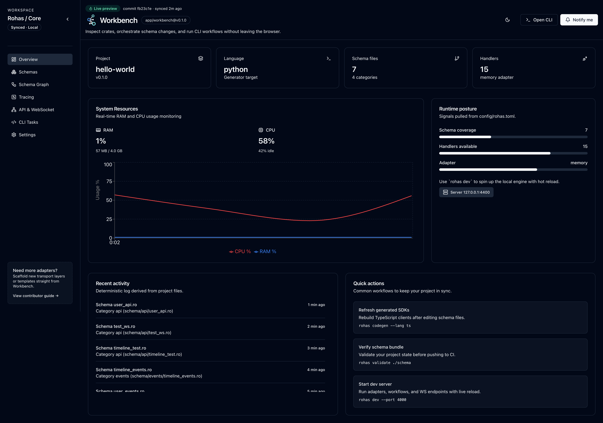
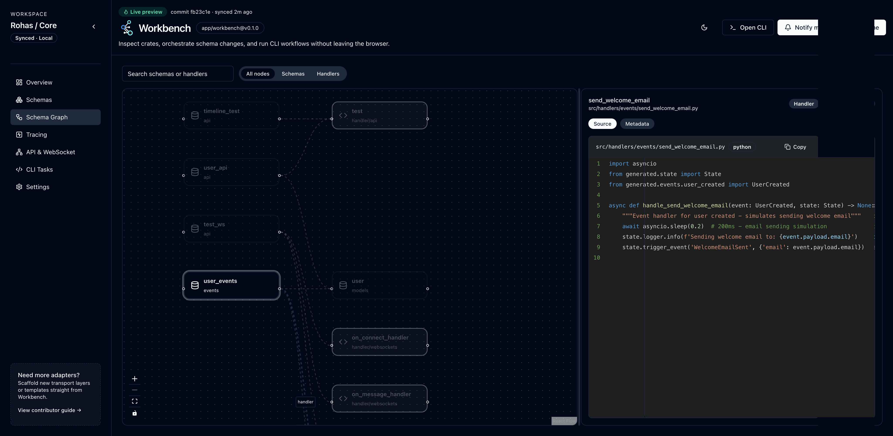
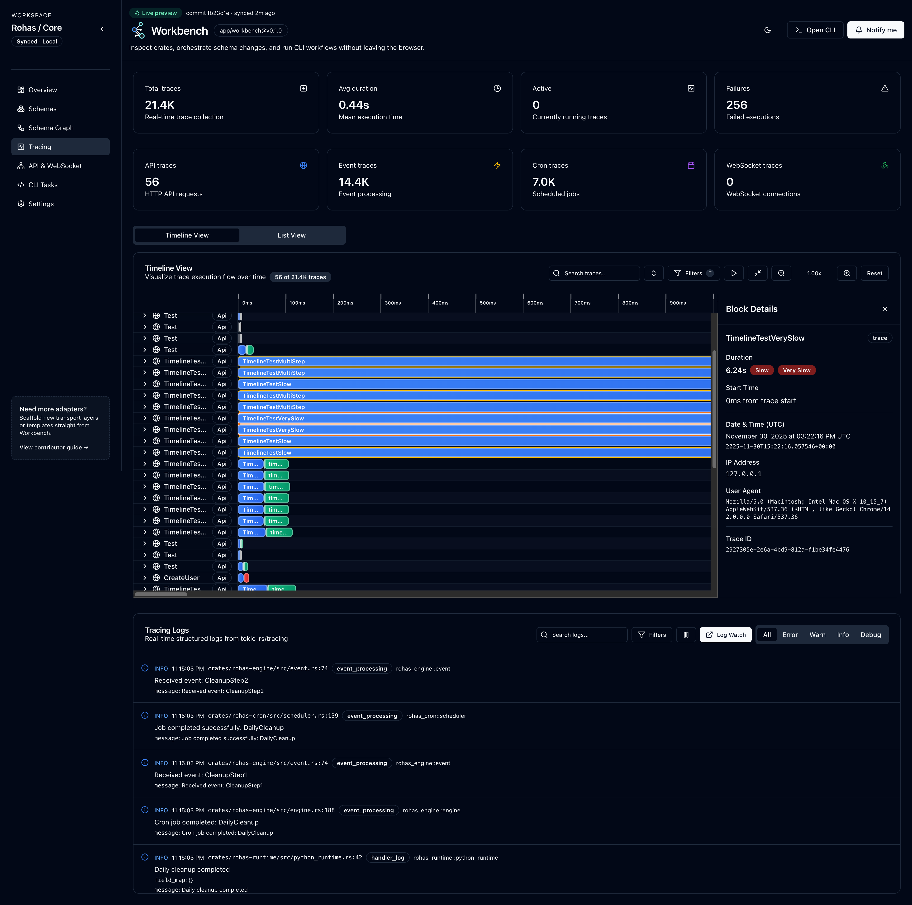

# Rohas


**The events you know. Built for AI-powered applications.**

Build scalable event-driven applications with schema-driven development. Python runtime support (fully support) with experimental TypeScript support, multiple event adapters, and powerful code generation.

## Features

- **Schema-Driven Development** - Define APIs, events, models, and cron jobs using simple schema files
- **Multi-Runtime Support** - Write handlers in Python and Rust (production-ready) or TypeScript/Node.js (experimental)
- **Event Adapters** - Connect to NATS, Kafka, RabbitMQ, SQS, or use in-memory adapters
- **Code Generation** - Auto-generate type-safe interfaces and handler stubs
- **Built-in Telemetry** - Integrated tracing, metrics, and logging
- **Hot Reload** - Development server with automatic reloading

## Workbench

Rohas includes a powerful workbench for visualizing, debugging, and monitoring your event-driven applications in real-time.

<div align="center">
  
</div>

<div align="center">
  
  
</div>

## Quick Start

### Installation

```bash
curl -fsSL https://raw.githubusercontent.com/rohas-dev/rohas/main/scripts/build.sh | bash
```

### Initialize a Project

```bash
# Python (recommended)
rohas init my-app --lang python

# Rust (recommended)
rohas init my-app --lang rust

# TypeScript (experimental)
rohas init my-app --lang typescript
```

### Run codegen

```bash
cd my-app
rohas codegen
```

### Start Development

```bash
rohas dev --workbench
```

## Roadmap

### Current Status

✅ Schema-driven development with `.ro` files  
✅ Python runtime (production-ready)  
✅ TypeScript runtime (experimental)  
✅ Event adapters
✅ Code generation for type-safe handlers  
✅ Development server with hot reload  
✅ Workbench UI for development  

### Upcoming

For the complete roadmap, visit: https://www.rohas.dev/en/docs/roadmap

## Documentation

For complete documentation, examples, and guides, visit:

- **Website**: https://www.rohas.dev/
- **Documentation**: https://www.rohas.dev/en/docs

## License

MIT License - see [LICENSE](LICENSE) file for details.
